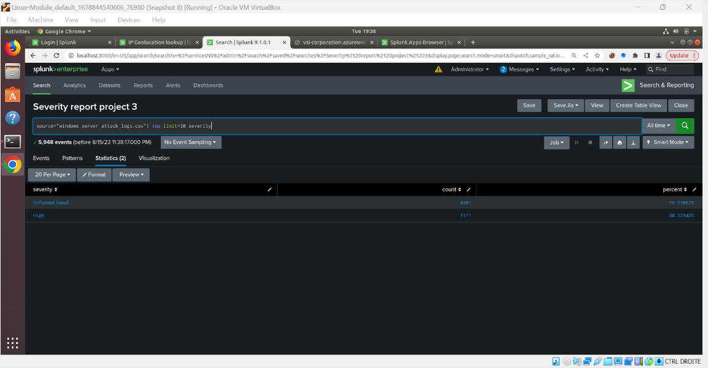

# Project Title: VSI-Monitoring-Solution-Splunk
Date: Aug 2023- Sep 2023

## Overview
Creation of a monitoring environment for incident response, ensuring the security of a mock organization (VSI) via Splunk

## Key Achievements
-Analyzed activity logs (Windows and Apache Server logs) to understand what activities are happening within the server as well as selecting a baseline for the organization to detect anything suspicious for any subset of data analyzed ie: severity, signature, IP address etc...
-Developed and executed custom alerts/reports/dashboard accodingly to the baseline that was set and those information will directly be reported to the person in charge of the security by email as soon as the baseline exceed the threshold selected. This is very helpful to detect and counter anomalies in real time.
-Enhanced the monitoring capabilities by integrating a Splunk "add-on" app, chosen specifically to make a more friendly-user dashboard environment and fortify defense against a certain type of cyber attack.

## Technologies Used
-Splunk

## Screenshots

