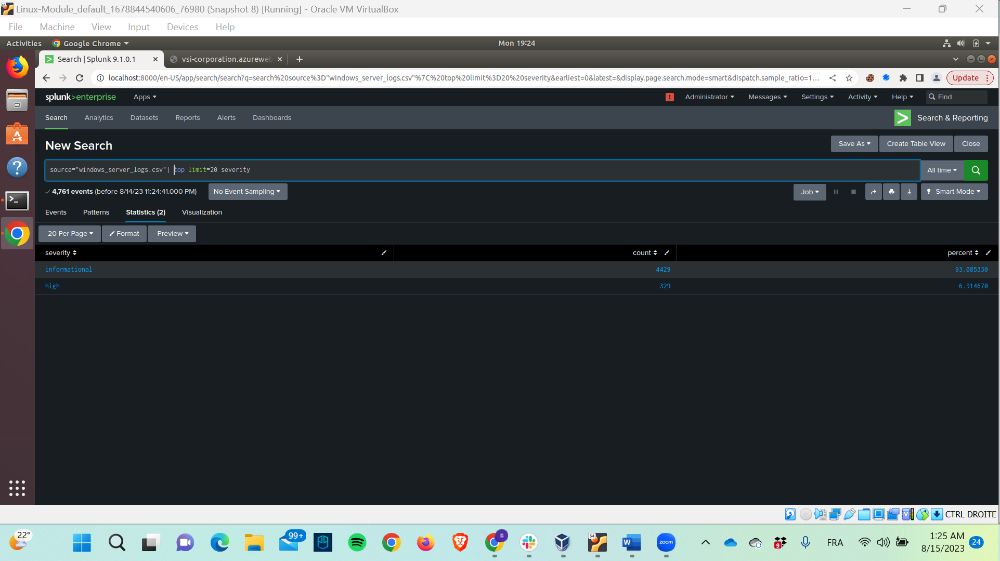
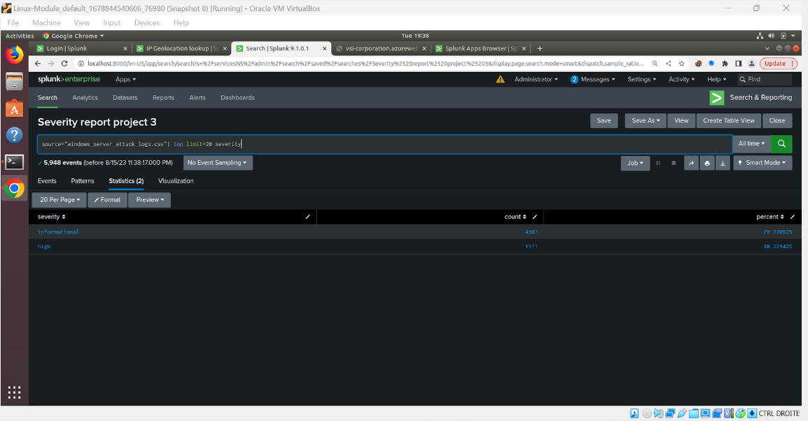
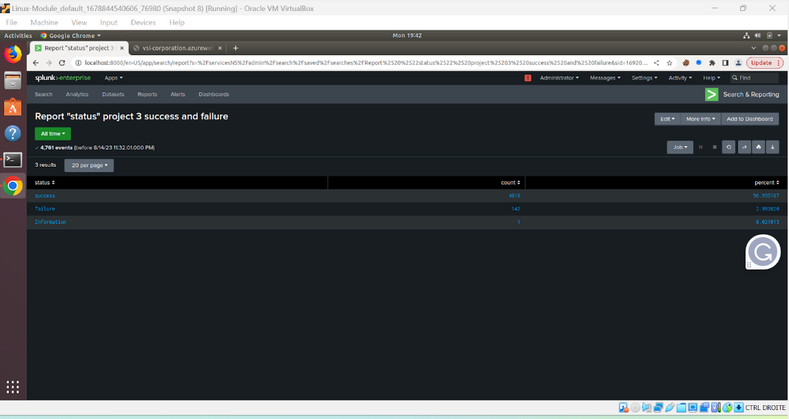
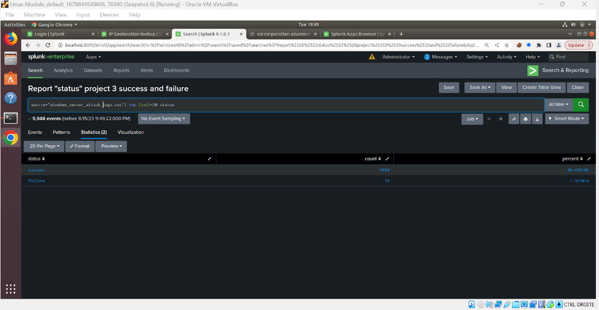
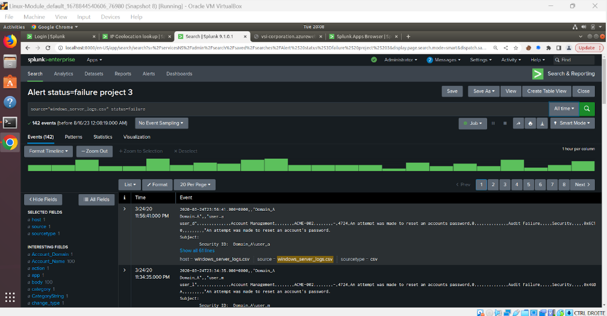
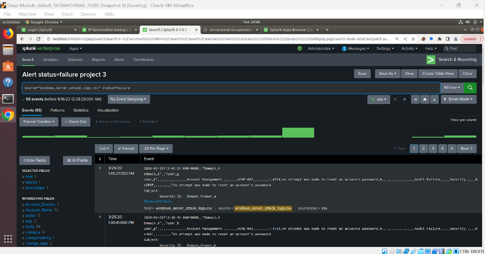
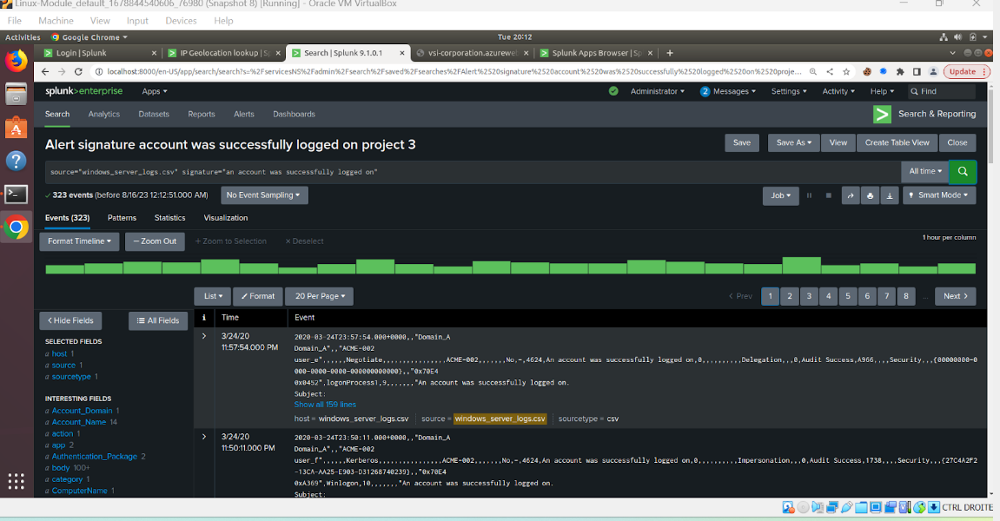
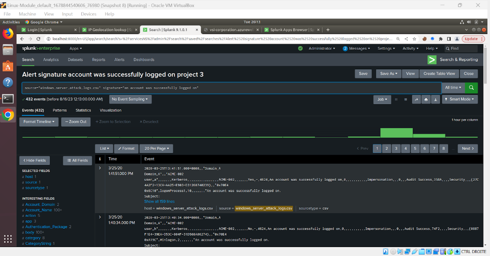
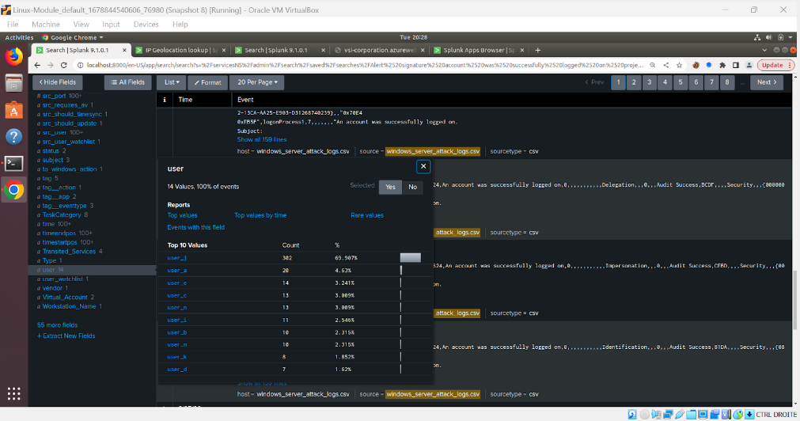

# Project Title: VSI-Monitoring-Solution-Splunk
Date: Aug 2023- Sep 2023

## Overview
Creation of a monitoring environment for incident response, ensuring the security of a mock organization (VSI) via Splunk

## Key Achievements
I) Analyzed activity logs (Windows and Apache Server logs) to understand what activities are happening within the server as well as selecting a baseline for the organization to detect anything suspicious for any subset of data analyzed ie: severity, failed/successful activities, volume, signature, IP address etc...

II) Developed and executed custom alerts/reports/dashboard accodingly to the baseline that was set and those information will directly be reported to the person in charge of the security by email as soon as the baseline exceed the threshold selected. This is very helpful to detect and counter anomalies in real time.

III) Enhanced the monitoring capabilities by integrating a Splunk "add-on" app, chosen specifically to make a more friendly-user dashboard environment and fortify defense against a certain type of cyber attack.

## Technologies Used
-Splunk

## Screenshots
4 sets of logs:

-Windows server  
-Windows server attack logs
-Apache server
-Apache server attack logs

I) Analysis of Logs and comparison of data from the server before and after an attack:
1) Changes in windows logs for severity data?
   
-After loading the logs of the Windows server both the attack and non attack, there were suspicious changes in severity as the informational severity went from 93% from the normal Windows logs to 79% and the high severity from 6% from the normal Windows logs to 20% within the new file which shows a higher severity. A report was made to show to the company what happened and will be directly sent to them at the hour the report was scheduled to be sent.

2) Changes in windows logs for failed activities?
   
-The changes in failure went from 2.98% to 1.56% and the successful activities went from 96% to 98% and the informational activities went from 1 to 0. Overall, it is not that suspicious. Even if it was not suspicious, a report was made and will be sent to the company at a specific hour to show the data and inform them on what happened. 
-
-

3) Changes in windows logs for volume failed activities?

-We can clearly see the changes of behavior from the screenshot of the volume of failed activities shown in the small green graph. Moreover, an alert was set with a specific baseline which in this case was 8 from the normal logs. Therefore, as the second screenshot shows, the volume of failed activities reached 35 events at 8:00 AM, so in this case the alert will be triggered and sent to the company to inform them.
-
-

4) Changes in windows logs for signature "successfully logged on" activities?

-When comparing both windows files, the “attack” file has a suspicious volume of successful logins reaching 196 events at 11:00 AM on Wednesday 25th 2020.
-
-

5) Principal user that was successfully logged on that many times?

-While going through the tabs on the left side of Splunk we can see different tabs associated to what we are looking for. Therefore, I was able to check the "user" tab and analyze which user was logging in that many times.
-

